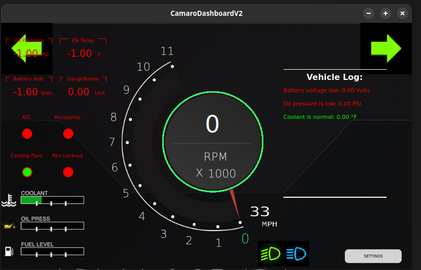

# Camaro Dashboard V2 App

A modern, customizable dashboard application for Holley EFI vehicles, featuring real-time monitoring, advanced data visualization, and a powerful LUA-based alarm engine.
A "constant work in progress" 🙂



## Overview

Qt-based application designed to provide real-time monitoring and visualization of vehicle performance metrics. The application integrates with vehicle CAN bus systems to collect data from various sensors and presents them in an intuitive, user-friendly interface. Additionally, a large component of Holley's CAN protocol has been reverse engineered to allow spoofing external I/O modules.

Key features include:
- Real-time gauge visualization for critical vehicle parameters
- CAN bus integration for direct communication with vehicle systems
- GPS tracking and navigation capabilities
- Customizable digital and image-based gauges
- Interactive shell for system control and diagnostics
- Advanced LUA-based alarm engine for custom monitoring rules

## LUA Alarm Engine

At the core of the dashboard's monitoring capabilities is a LUA-based alarm engine that allows for highly customizable sensor monitoring and alert generation.

### How It Works

The alarm engine enables users to define custom monitoring rules using LUA scripts. Each rule is associated with a specific sensor and can evaluate sensor data against custom thresholds and conditions. When a condition is met, the engine can trigger notifications or actions.

Key features of the LUA Alarm Engine:

1. **Custom Rule Definition**: Create monitoring rules for any sensor using LUA scripts
2. **Real-time Evaluation**: Rules are continuously evaluated against the latest sensor data
3. **Persistent Storage**: Rules can be saved to and loaded from JSON files
4. **Multiple Sensor Support**: Monitor various vehicle parameters including:
   - RPM
   - Coolant Temperature
   - Oil Pressure
   - Oil Temperature
   - Battery Voltage
   - Fuel Level
   - Injector Duty Cycle
   - Vehicle Speed

### Creating Custom Rules

Each rule consists of a sensor name and an associated LUA script. The LUA script must define an `evaluateSensorRule()` function that takes the sensor value as input and returns two values:
1. A boolean indicating if an error condition was detected
2. A message string describing the condition

Example LUA script:

```lua
function evaluateSensorRule(sensorValue)
    if RPM > 6000 then
        return true, "RPM exceeding safe limit!"
    elseif coolantTemperature > 220 then
        return true, "Engine overheating!"
    elseif oilPressure < 20 and RPM > 2000 then
        return true, "Low oil pressure at high RPM!"
    else
        return false, "All systems normal"
    end
end
```

### Integration with Dashboard

The alarm engine runs in a dedicated thread, continuously evaluating all defined rules against the latest sensor data. When a rule detects an error condition, it triggers the log handler which can display notifications, log events, or take other actions as defined in the application.

## Building and Installation

### Prerequisites

- Qt 6.0 or later
- CMake 3.14 or later
- LUA 5.3 or later
- Compiler supporting C++17

### Build Instructions

1. Clone the repository:
   ```
   git clone https://github.com/yourusername/camarodashboardv2app.git
   cd camarodashboardv2app
   ```

2. Configure and build with CMake:
   ```
   mkdir build && cd build
   cmake ..
   make
   ```

3. Run the application:
   ```
   ./CamaroDashboardV2
   ```

## Development

### Project Structure

- `src/`: Source code for the application
  - `AlarmEngine.h/cpp`: Implementation of the LUA-based alarm engine
  - `main.cpp`: Application entry point and thread management
  - `canThread.cpp`: CAN bus communication
  - Various gauge and UI controllers
- `content/`: QML files for UI components
- `imports/`: QML imports and modules

## Acknowledgments

- Qt framework for the UI components
- LUA for the scripting engine
